<div align="center">

<!-- Hero Banner -->


# 🚀 XFounders — Where Founders Are Forged

### _The Digital Epicenter of Campus Entrepreneurship_

[](https://xfounders.onrender.com/)
[](https://nextjs.org/)
[](https://www.typescriptlang.org/)
[](https://tailwindcss.com/)
[](https://firebase.google.com/)

<br/>

<p align="center">
  <b>Built with ❤️ by <a href="https://jayeshjadhav.com">Jayesh Jadhav</a></b> — Tech Lead @ XFounders | Campus Ambassador, E-Cell IIT Bombay
</p>

---


</div>

## 🎯 What is XFounders?

> **XFounders** is the official **Entrepreneurship & Innovation Cell** of **Dnyanshree Institute of Engineering and Technology (DIET), Satara**, formed under the **National Entrepreneurship Challenge (NEC 2025)** — an initiative by **E-Cell IIT Bombay**.

We're not just building a website — we're building a **movement**. A platform where student entrepreneurs connect, innovate, and launch ventures from campus.

<div align="center">

```
  ╔══════════════════════════════════════════════════════╗
  ║                                                      ║
  ║    💡 IDEATE  →  🛠️ BUILD  →  🚀 LAUNCH  →  📈 SCALE  ║
  ║                                                      ║
  ╚══════════════════════════════════════════════════════╝
```

</div>

---

## ✨ Features

<table>
<tr>
<td width="50%">

### 🏠 Core Platform
- 🎨 **Modern UI/UX** — Sleek, responsive design with dark/light mode
- 🚀 **3D Interactive Elements** — Animated rocket component using Three.js
- 🔐 **Authentication** — Firebase Auth with login/signup flows
- 👤 **User Profiles** — Personalized dashboards & settings

</td>
<td width="50%">

### 📊 Explore Hub
- 📈 **Startup Trends** — Real-time industry insights
- 💰 **Funding Resources** — Curated funding opportunities
- 📖 **Success Stories** — Inspiring founder journeys
- 📋 **Regulations** — Startup compliance guides

</td>
</tr>
<tr>
<td width="50%">

### 🎪 Events & Community
- 📅 **Event Listings** — Workshops, hackathons, bootcamps
- 📝 **Event Registration** — Modal-based RSVP system
- 🖼️ **Gallery** — Event highlights & memories
- 📧 **Contact System** — EmailJS-powered communication

</td>
<td width="50%">

### 👥 Team Showcase
- 🃏 **Team Cards** — Dynamic member profiles
- 🏷️ **Role Badges** — Tech Lead, Designer, Secretary, etc.
- 🔗 **Social Links** — Connect with team members
- 📱 **Fully Responsive** — Mobile-first approach

</td>
</tr>
</table>

---

## 🛠️ Tech Stack

```mermaid
graph LR
    A[Next.js 15] --> B[React 18]
    B --> C[TypeScript]
    C --> D[Tailwind CSS]
    D --> E[shadcn/ui]
    E --> F[Firebase]
    F --> G[EmailJS]
    G --> H[Render]

    style A fill:#000,stroke:#fff,color:#fff
    style B fill:#61DAFB,stroke:#000,color:#000
    style C fill:#3178C6,stroke:#fff,color:#fff
    style D fill:#06B6D4,stroke:#fff,color:#fff
    style E fill:#18181B,stroke:#fff,color:#fff
    style F fill:#FFCA28,stroke:#000,color:#000
    style G fill:#FF6B6B,stroke:#fff,color:#fff
    style H fill:#46E3B7,stroke:#000,color:#000
```

<div align="center">



</div>

| Layer | Technology |
|:---:|:---|
| ⚡ **Framework** | [Next.js 15](https://nextjs.org/) (App Router) |
| 🧩 **Language** | [TypeScript](https://www.typescriptlang.org/) |
| 🎨 **Styling** | [Tailwind CSS](https://tailwindcss.com/) + [shadcn/ui](https://ui.shadcn.com/) |
| 🔥 **Backend** | [Firebase](https://firebase.google.com/) (Auth + Firestore) |
| 📧 **Email** | [EmailJS](https://www.emailjs.com/) |
| 🚀 **3D Graphics** | Three.js / React Three Fiber |
| ☁️ **Deployment** | [Render](https://render.com/) |
| 📦 **Package Manager** | pnpm |

---

## 📁 Project Architecture

```
xfounders/
│
├── 🧩 components/
│   ├── 3d/                    # 3D interactive components
│   │   └── InteractiveRocket  # Animated rocket visualization
│   ├── auth/                  # Authentication components
│   ├── events/                # Event cards & registration
│   ├── explore/               # Explore section grids
│   ├── layout/                # Header & Footer
│   ├── sections/              # Landing page sections
│   │   ├── HeroSection        # Above-the-fold hero
│   │   ├── StatsSection       # Key metrics display
│   │   ├── VisionMission      # About XFounders
│   │   └── CTASection         # Call-to-action
│   ├── team/                  # Team member cards
│   └── ui/                    # shadcn/ui components (40+)
│
├── 📱 src/app/
│   ├── api/                   # API routes
│   │   ├── contact/           # Contact form handler
│   │   └── explore/           # Dynamic content APIs
│   ├── auth/                  # Login & Signup pages
│   ├── contact/               # Contact page
│   ├── events/                # Events listing
│   ├── explore/               # Explore hub (5 categories)
│   ├── gallery/               # Photo gallery
│   ├── profile/               # User profile
│   ├── settings/              # User settings
│   └── team/                  # Team showcase
│
├── 🔧 contexts/               # React Context (Auth)
├── 🪝 hooks/                  # Custom hooks
├── 📚 lib/                    # Utilities & configs
│   ├── firebase.ts            # Firebase initialization
│   ├── emailjs.ts             # Email service config
│   └── utils.ts               # Helper functions
│
└── 🖼️ public/                 # Static assets & team photos
```

---

## ⚡ Quick Start

### Prerequisites

```bash
node -v  # v18+ required
pnpm -v  # or npm/yarn
```

### Installation

```bash
# Clone the repository
git clone https://github.com/YOUR_USERNAME/xfounders.git
cd xfounders

# Install dependencies
pnpm install

# Set up environment variables
cp .env.example .env.local
```

### Environment Variables

Create a `.env.local` file:

```env
# Firebase
NEXT_PUBLIC_FIREBASE_API_KEY=your_api_key
NEXT_PUBLIC_FIREBASE_AUTH_DOMAIN=your_auth_domain
NEXT_PUBLIC_FIREBASE_PROJECT_ID=your_project_id
NEXT_PUBLIC_FIREBASE_STORAGE_BUCKET=your_storage_bucket
NEXT_PUBLIC_FIREBASE_MESSAGING_SENDER_ID=your_sender_id
NEXT_PUBLIC_FIREBASE_APP_ID=your_app_id

# EmailJS
NEXT_PUBLIC_EMAILJS_SERVICE_ID=your_service_id
NEXT_PUBLIC_EMAILJS_TEMPLATE_ID=your_template_id
NEXT_PUBLIC_EMAILJS_PUBLIC_KEY=your_public_key
```

### Development

```bash
# Start dev server
pnpm dev

# Build for production
pnpm build

# Start production server
pnpm start
```

<div align="center">

🌐 Open [http://localhost:3000](http://localhost:3000) in your browser

</div>

---

## 📸 Screenshots

<div align="center">

| Home Page | Team Section |
|:---:|:---:|
|  |  |

| Events | Explore Hub |
|:---:|:---:|
|  |  |

</div>

> 💡 _Replace placeholders with actual screenshots of your deployed site_

---

## 🤝 The XFounders Team

<div align="center">

We are a multidisciplinary team of **student leaders and visionaries** serving as:

`Tech Leads` · `Secretaries` · `Designers` · `Content Creators` · `Campus Ambassadors`

</div>

---

## 🏗️ Built Under

<div align="center">

<table>
<tr>
<td align="center" width="300">

### 🏛️ NEC 2025
**National Entrepreneurship Challenge**
<br/>
An initiative by **E-Cell IIT Bombay**

</td>
<td align="center" width="300">

### 🎓 DIET, Satara
**Dnyanshree Institute of Engineering & Technology**
<br/>
Building the next generation of founders

</td>
</tr>
</table>

</div>

---

## 👨‍💻 Developer

<div align="center">


### Jayesh Jadhav

**Tech Lead** @ XFounders | **Campus Ambassador** @ E-Cell IIT Bombay

[](https://jayeshjadhav.com/)
[](https://linkedin.com/in/jayeshjadhav)
[](https://github.com/YOUR_USERNAME)

</div>

---

## 📄 License

This project is licensed under the **MIT License** — see the [LICENSE](LICENSE) file for details.

---

<div align="center">

### ⭐ Star this repo if you believe in the power of student entrepreneurship!

<br/>

```
██╗  ██╗███████╗ ██████╗ ██╗   ██╗███╗   ██╗██████╗ ███████╗██████╗ ███████╗
╚██╗██╔╝██╔════╝██╔═══██╗██║   ██║████╗  ██║██╔══██╗██╔════╝██╔══██╗██╔════╝
 ╚███╔╝ █████╗  ██║   ██║██║   ██║██╔██╗ ██║██║  ██║█████╗  ██████╔╝███████╗
 ██╔██╗ ██╔══╝  ██║   ██║██║   ██║██║╚██╗██║██║  ██║██╔══╝  ██╔══██╗╚════██║
██╔╝ ██╗██║     ╚██████╔╝╚██████╔╝██║ ╚████║██████╔╝███████╗██║  ██║███████║
╚═╝  ╚═╝╚═╝      ╚═════╝  ╚═════╝ ╚═╝  ╚═══╝╚═════╝ ╚══════╝╚═╝  ╚═╝╚══════╝
```

**Built with 🔥 from DIET, Satara for NEC 2025**

<sub>Made with ❤️ by <a href="https://jayeshjadhav.com">Jayesh Jadhav</a> | © 2025 XFounders</sub>

</div>